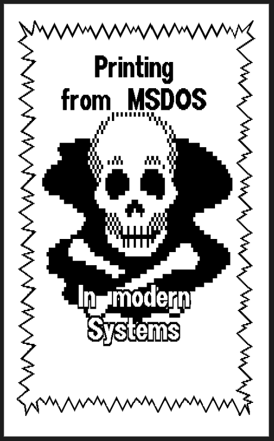
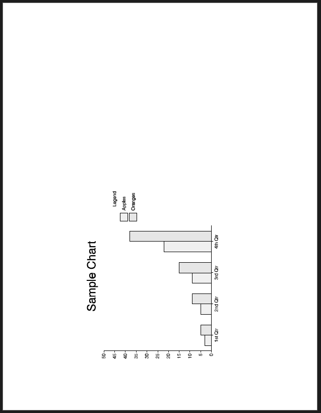
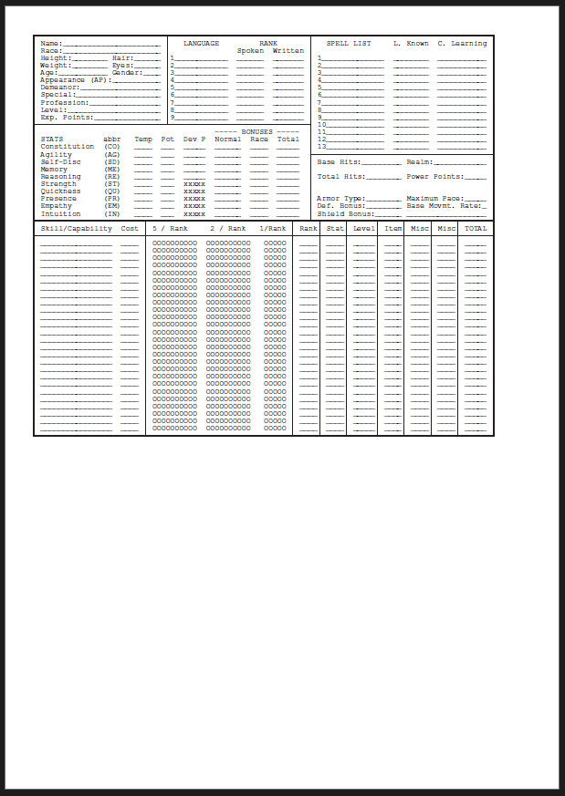

# dosprint
Print from DOSBox (or raw input) using EPSON FX dialect (or postcript)

## Introduction

Printing from DOS apps is a "pain in the ass" due each program has its specific driver, there are few
dot matrix printers working, lot of programs use continuous paper, no feeders... etc. After recovering
some old backup disks, I try to print all the data in a "modern" format so I can access it, so I build
this little tool to ease the printing from DOS apps into modern platforms.


## How it works

First of all, I use DOSBOX to run the emulation, to ease the process. I configure the printing to use
the `LPT1` port, and a raw capture to a folder (folder capture. See this `dosbox.conf` configuration:

```
[dosbox]
captures  = capture

[parallel]
parallel1=file timeout=2000

[printer]
printer     = true
dpi         = 360
width       = 85
height      = 110
printoutput = printer
multipage   = false
device      = -
docpath     = .
fontpath    = FONTS
openwith    = start
openerror   = 
printdbcs   = auto
shellhide   = false
timeout     = 0
```

The `[printer]` section is not used, due the `parallel1` dumps all the raw content into a file in the 
`%DOSBOXDIR%/capture` directory, named as the program executed (e.g. `fp_0001.prt`). With this file,
The script invokes [GhostScript](https://pages.cs.wisc.edu/~ghost/) if the raw file is *Postcript* or 
[RWAP/PrinterToPDF](https://github.com/RWAP/PrinterToPDF) if its *EPSON language (ESC/P or P2)*

Due `RWAP/PrinterToPDF` compiles on Linux and I haven't time to port it to windows, you need to run 
everything on a Linux platform. I use [ubuntu](https://ubuntu.com/download) as distribution, but you 
can use any that you want, also a [docker](https://www.docker.com/) container.

## Requirements

You need:

* [RWAP/PrinterToPDF](https://github.com/RWAP/PrinterToPDF) is an excellent module from Rich M, that
is used for converting captured Epson ESC/P and ESC/P2 dot matrix and inkjet printer data files to PDF format. The 
program needs to be compiled and require [LibHaru](https://github.com/libharu) but it's easy, they provide [Install Instructions](https://github.com/libharu/libharu/wiki/Installation)

* [GhostScript](https://pages.cs.wisc.edu/~ghost/). Ghostscript is an interpreter for the PostScript®  language and PDF files. It is available under either the GNU GPL Affero license or  licensed for commercial use from Artifex Software, Inc. It has been under active development for over 30 years and has been ported to several different systems during this time. Ghostscript consists of a PostScript interpreter layer and a graphics library.

* [Python3](https://www.python.org/downloads/) with the following packages:

    * [PyPDF2](https://github.com/py-pdf/pypdf) To create the final pdf file. `apt-get install python3-pypdf2`
    * [PILLOW](https://github.com/python-pillow/Pillow) To process the png files and extract white pages `apt-get install python3-pil`     


## installation

### Required Packages (on Ubuntu)

First of all, install all the required packages to build the libraries (`cmake, gcc, etc`)

```bash
% apt-get install cmake perl gcc dkms build-essential module-assistant
% apt-get install libpng-dev ImageMagick libsdl-image1.2-dev
```

### LibHaru

Its a requirement to build `RWAP/PrinterToPDF`

From the [Install Instructions](https://github.com/libharu/libharu/wiki/Installation):

1) Download the [LibHaru's latest Release 2.3.0 at this point](https://github.com/libharu/libharu/archive/RELEASE_2_3_0.zip)
2) Unpack it:

```
% cd /tmp
% unzip RELEASE_2_3_0.zip
% mkdir build
% cd build
% cmake ../libharu-RELEASE_2_3_0
```

3) Install it (as `root`) (under `/usr/local/include` and `/usr/local/lib`) 

```
% sudo su - 
# cd /tmp
# make clean
# make
# make install
```

### RWAP/PrinterToPDF

First of all, we need to patch the file in order to get it working. From the documentation: *"COMPILING On some versions of Linux, you will need to change the reference in line 11 to read: `#include "/usr/local/include/hpdf.h`"*. The file  
`PrinterToPDF/PrinterConvert.c`:should look like this.

```C
 9 #include <png.h>
10 #include <setjmp.h>
11 #include "/usr/local/include/hpdf.h"  /* instead of "/usr/local/hpdf.h" */
12 #include "/usr/include/SDL/SDL.h"
13 #include "dir.c"
...
```

Also, the library **needs** to be configured to save the `png` files instead of working in memory, if you want to support clean the 'white pages' (some pages are printed empty, and when building the final pdf, the script removes then). Just do the following change in `PrinterToPDF/PrinterConvert.c`:

```c
460 int initialize(const char* input_filename)
461 {
462    // Choose PNG Generation mode - 1 = in memory (fast but uses a lot more memory), 2 = use external file (slower, but less memory)
463    imageMode = 2; // replace 1 with 2
...

```

I provide [the patched file](priterToPDF/PrinterConvert.c) here.


Now, you get the binary file `PrinterToPDF`, copy it to `PrinterToPDF_png`, or change the script configuration (see below). The program requires some fonts to work, so make sure that [font2](font2/) directory, [printerToPDF](printerToPDF.png) and [print.py](print.py) files are in the same directory in order to work.

### Python3 (and dependencies)

Install python3 and the following modules. Due I install it on an ubuntu distro, I choose the distro's packages, but you can use the standard `pip` method if you want.
 
```
% apt-get install python3 python3-pypdf2 python3-pil
% apt-get install ghostcript
```

### print.py 

`print.py` is the script that helps converting the raw files to pdf files. Support EPSON language, and Poscript files. Also scans the pdf for empty pages, and remove them from the output. Support multi page PDFS.

```
usage: print.py [-h] [-v] [-l] [-p] [-g] [-m MODE] input [input ...]

positional arguments:
  input                 input file to print (support dir on batchmode)

options:
  -h, --help            Show this help message and exit
  -v, --verbose         Show data about file and processing
  -l, --landscape       Select Landscape mode
  -p, --preserve        Preserve data
  -g, --gs              Run using Ghostcript to generate PDF (PS printing)
  -m MODE, --mode MODE  Select mode
```
- `-h`, `--help` show this help message and exit
- `-v`, `--verbose` show data about file and processing
- `-l`, `--landscape` select Landscape mode
- `-p`, `--preserve` preserve data (don't delete the tmp file `/tmp/print_xxxxx` (for debug))
- `-g`, `--gs` run using Ghostcript to generate PDF (Poscript printing)
- `-m MODE`, `--mode MODE` select mode. If mode is not configured, the script uses `auto` and try to detect the mode based on the name of the file (e.g. `fp_0000.prt` will use `fp` mode.) There are some predefined modes:
    * `A4` (210mm,297mm) standard A4 paper.
    * `folio` (215mm,315mm) old paper size. I use it a lot.
    * `fp` (210mm,310mm) first publisher's special paper.
    * `Letter` (215.9mm,279.4mm)
    * `pmmain` (205mm,335mm) print master's sizes.

#### Configuration

You can configure the path for the `PrinterToPDF_png` and the `gs` (ghostcript) commands. Just edit `print.py` and change it in the class definition. You can add more paper/program configurations, and change the default font for  `PrinterToPDF_png` (default font: `font2/Epson-Standard.C16`)

```python
class PrintManager:
    cmd = "./printerToPDF_png"
    gs  = "/usr/bin/gs" 
    font = "font2/Epson-Standard.C16"
    sizes = {
        'A4'     : [210,297    , 2.5, 2.5, 2.5, 2.5],   # width, height, ML, MR, MT, MB  A4
        'folio'  : [215,315    , 2.5, 2.5, 2.5, 2.5],   # width, height, ML, MR, MT, MB  Old paper size (mine)
        'fp'     : [210,310    , 0,   0,   0,   0  ],   # width, height, ML, MR, MT, MB  Custom Firt Publisher Size (A4+)
        'Letter' : [215.9,279.4, 2.5, 2.5, 2.5, 2.5],   # width, height, ML, MR, MT, MB  Letter
        'pmmain' : [205,335    , 2.5, 2.5, 2.5, 2.5],   # width, height, ML, MR, MT, MB  Print Master (very large page)
    }

```

### Examples

#### Example #1 Print EPSON file from PrintMaster

```
% ./print.py -v -m pmmain ./examples/pmmain_000.prt
```

```
[BEGIN] [./examples/pmmain_000.prt] ---
 -> mode selected by file: pmmain
 -> Command [./printerToPDF_png -o /tmp/printj5z6h3nb -f font2/Epson-Standard.C16 -p 205,335 -m 2.5,2.5,2.5,2.5 ./examples/pmmain_000.prt]
  >  
  >  delays around ack: t1=0    t2=0    t3=0    t4=0    t5=0
  >  write   = /tmp/printj5z6h3nb/png/page1.png
  >  
  >  
  >  I am at page 2
  >  write   = /tmp/printj5z6h3nb/png/page2.png
  >  command = cp  ./examples/pmmain_000.prt  /tmp/printj5z6h3nb/eps/
 -> Merging 2 pdf pages into /tmp/printj5z6h3nb/pmmain_000.pdf
 -> Empty page found at /tmp/printj5z6h3nb/pdf/page2.pdf
 -> Copy /tmp/printj5z6h3nb/pmmain_000.pdf -> ./examples/pmmain_000.pdf
[END] ---

Done! (1 files processed)
```



[output file (PDF)](examples/pmmain_000.pdf)

#### Example #1 Print POSCRIPT file from DrawPerfect

```
% ./print.py -v -g ./examples/dr_000.prt
```

```
 [BEGIN] [./examples/dr_000.prt] ---
 -> Command [/usr/bin/gs -sDEVICE=pdfwrite -dPDFSETTINGS=/prepress -dHaveTrueTypes=true -dEmbedAllFonts=true  -dSubsetFonts=false -o '/tmp/print_wymnu_l/pdf/page%d.pdf' -DNOSAFER  -dNOPAUSE -dBATCH -f ./examples/dr_000.prt]
  >  GPL Ghostscript 10.02.1 (2023-11-01)
  >  Copyright (C) 2023 Artifex Software, Inc.  All rights reserved.
  >  This software is supplied under the GNU AGPLv3 and comes with NO WARRANTY:
  >  see the file COPYING for details.
 -> GS PNG Command [/usr/bin/gs -sDEVICE=pdfwrite -dPDFSETTINGS=/prepress -dHaveTrueTypes=true -dEmbedAllFonts=true  -dSubsetFonts=false -o '/tmp/print_wymnu_l/pdf/page%d.pdf' -DNOSAFER  -dNOPAUSE -dBATCH -f ./examples/dr_000.prt]
 -> Merging 1 pdf pages into /tmp/print_wymnu_l/dr_000.pdf
 -> Copy /tmp/print_wymnu_l/dr_000.pdf -> ./examples/dr_000.pdf
[END] ---

Done! (1 files processed)
```



[output file PDF](examples/dr_000.pdf)

Also, another, text only postcript file from wordperfect:


### Example #2 Print POSCRIPT file from WordpPerfect (multiple files)

Sometimes, for complex documents (e.g. with lines) WordPerfect 5.1 creates some files `wp_000x.prt`. The first has the 
postcript preamble, and the rest has the data. you must concatenate all the files together, and then print it:

```
% cat ../wp_*.prt > ../wp.prt
% ./print.py -v -g ../wp.prt
```



[output file PDF](examples/ROLMAST.pdf)

### TIPS

* For Poscript printer, use `Xerox 4219/MRP (PS)` (e.g. wordperfect 5.1).
* Always config the printer as `LPT1:` port.
* For EPSON printers, use `EPSON FX/80 or FX/85`
